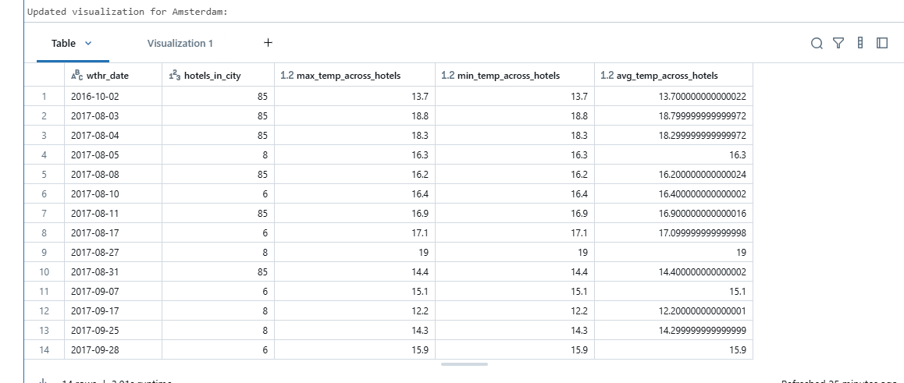
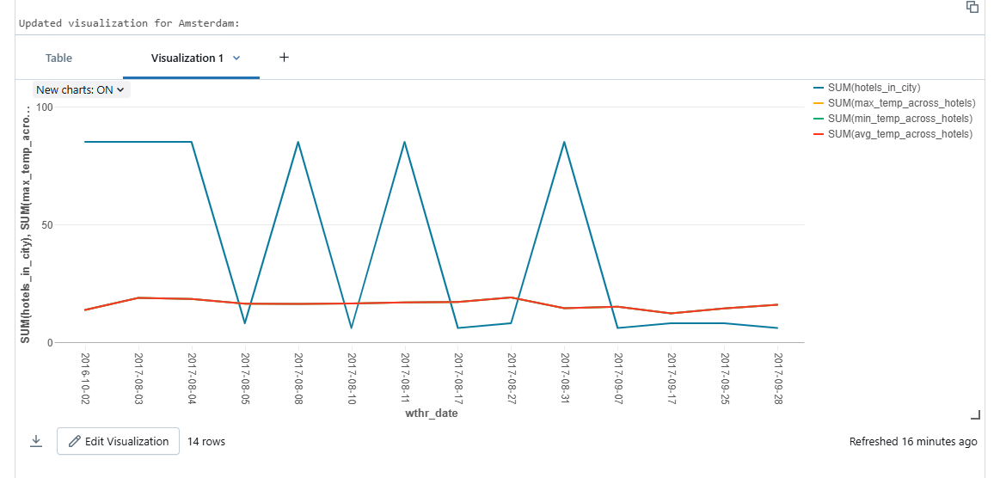

# Spark Structured Streaming application

## 1. I have project on GCP

## 2. Installed the Google Cloud CLI

## 3. Ran the terraform scripts

## 4. Got databricks free trial

## 5. Created a population file

I've created a file named populating.py which takes files from my local folder and incrementally uplaods them to GCP bucket

## 6. Created a Streaming dataframe, which uses autoloader to load data

```python
from pyspark.sql.types import *

schema = StructType([
    StructField("address", StringType(), False),
    StructField("avg_tmpr_c", DoubleType(), False),
    StructField("avg_tmpr_f", DoubleType(), False),
    StructField("city", StringType(), False),
    StructField("geoHash", StringType(), False),
    StructField("country", StringType(), False),
    StructField("id", StringType(), False),
    StructField("latitude", DoubleType(), False),
    StructField("longitude", DoubleType(), False),
    StructField("name", StringType(), False),
    StructField("wthr_date", StringType(), False),
    StructField("wthr_year", StringType(), True),
    StructField("wthr_month", StringType(), True),
    StructField("wthr_day", StringType(), True),
])

streaming_df = spark.readStream.format("cloudFiles").option("cloudFiles.includeExistingFiles", "true").schema(schema).option("cloudFiles.format", "parquet").load("gs://storage-bucket-proud-cattle/hotel-weather")
```

I created a schema for the parquet files and loaded them incrementally.

## 7. Processing the data

For processing I've created a city_date_metrics dataframe, which aggregated the information.

then I used this dataframe and wrote stream, added trigger, so it would retrigger after one minute.

After that I've created a update_visualizations function, which main task is to display the results.
First it queries for the 10 cities, which had the most hotels during that day. After that it queries the
information of those cities and displays it with display() method.

```python
from pyspark.sql import functions as F

city_date_metrics = streaming_df.groupBy("city", "wthr_date") \
    .agg(
        F.approx_count_distinct("id").alias("hotels_in_city"),
        F.max("avg_tmpr_c").alias("max_temp_across_hotels"),
        F.min("avg_tmpr_c").alias("min_temp_across_hotels"),
        F.avg("avg_tmpr_c").alias("avg_temp_across_hotels")
    )

query = city_date_metrics.writeStream \
    .outputMode("complete") \
    .format("memory") \
    .queryName("hotel_metrics_stream") \
    .trigger(processingTime="1 minute") \
    .start()


def update_visualizations():
    if spark.catalog.tableExists("hotel_metrics_stream"):
        try:
            top_cities_df = spark.sql("""
                SELECT 
                    city,
                    MAX(hotels_in_city) as max_hotels_in_city
                FROM hotel_metrics_stream
                GROUP BY city
                ORDER BY max_hotels_in_city DESC
                LIMIT 10
            """)
            
            if top_cities_df.count() > 0:
                top_cities = [row.city for row in top_cities_df.collect()]
                
                for city in top_cities:
                    city_data = spark.sql(f"""
                        SELECT 
                            wthr_date,
                            hotels_in_city,
                            max_temp_across_hotels,
                            min_temp_across_hotels,
                            avg_temp_across_hotels
                        FROM hotel_metrics_stream
                        WHERE city = '{city}'
                        ORDER BY wthr_date
                    """)
                    
                    print(f"\nUpdated visualization for {city}:")
                    display(city_data)
            else:
                print("No data available yet in the stream results.")
        except Exception as e:
            print(f"Error updating visualizations: {e}")
    else:
        print("Waiting for stream to process data...")
```
## 8. Results
This is how it look after it read all of the data:


This is how it looks when running:


After running the
```python
update_visualizations()
```

Top 10 cities, their data table and visualization:

### Paris


### London


### Barcelona


### Milan


### Amsterdam





### Paddington


### San Diego


### New York


### Memphis


### Houston


## 9. Execution plans

These are my main dataframes and sink, which I analyzed.

### City_date_metrics

```python
city_date_metrics.explain(mode="extended")
```

```
== Parsed Logical Plan ==
'Aggregate ['city, 'wthr_date], ['city, 'wthr_date, 'approx_count_distinct('id) AS hotels_in_city#9466, 'max('avg_tmpr_c) AS max_temp_across_hotels#9467, 'min('avg_tmpr_c) AS min_temp_across_hotels#9468, 'avg('avg_tmpr_c) AS avg_temp_across_hotels#9469]
+- ~StreamingRelation DataSource(org.apache.spark.sql.SparkSession@75476b72,cloudFiles,List(),Some(StructType(StructField(address,StringType,false),StructField(avg_tmpr_c,DoubleType,false),StructField(avg_tmpr_f,DoubleType,false),StructField(city,StringType,false),StructField(geoHash,StringType,false),StructField(country,StringType,false),StructField(id,StringType,false),StructField(latitude,DoubleType,false),StructField(longitude,DoubleType,false),StructField(name,StringType,false),StructField(wthr_date,StringType,false),StructField(wthr_year,StringType,true),StructField(wthr_month,StringType,true),StructField(wthr_day,StringType,true))),List(),None,Map(cloudFiles.includeExistingFiles -> true, cloudFiles.format -> parquet, path -> gs://storage-bucket-proud-cattle/hotel-weather),None), cloudFiles, [address#9363, avg_tmpr_c#9364, avg_tmpr_f#9365, city#9366, geoHash#9367, country#9368, id#9369, latitude#9370, longitude#9371, name#9372, wthr_date#9373, wthr_year#9374, wthr_month#9375, wthr_day#9376]

== Analyzed Logical Plan ==
city: string, wthr_date: string, hotels_in_city: bigint, max_temp_across_hotels: double, min_temp_across_hotels: double, avg_temp_across_hotels: double
~Aggregate [city#9366, wthr_date#9373], [city#9366, wthr_date#9373, approx_count_distinct(id#9369, 0.05, 0, 0) AS hotels_in_city#9466L, max(avg_tmpr_c#9364) AS max_temp_across_hotels#9467, min(avg_tmpr_c#9364) AS min_temp_across_hotels#9468, avg(avg_tmpr_c#9364) AS avg_temp_across_hotels#9469]
+- ~StreamingRelation DataSource(org.apache.spark.sql.SparkSession@75476b72,cloudFiles,List(),Some(StructType(StructField(address,StringType,false),StructField(avg_tmpr_c,DoubleType,false),StructField(avg_tmpr_f,DoubleType,false),StructField(city,StringType,false),StructField(geoHash,StringType,false),StructField(country,StringType,false),StructField(id,StringType,false),StructField(latitude,DoubleType,false),StructField(longitude,DoubleType,false),StructField(name,StringType,false),StructField(wthr_date,StringType,false),StructField(wthr_year,StringType,true),StructField(wthr_month,StringType,true),StructField(wthr_day,StringType,true))),List(),None,Map(cloudFiles.includeExistingFiles -> true, cloudFiles.format -> parquet, path -> gs://storage-bucket-proud-cattle/hotel-weather),None), cloudFiles, [address#9363, avg_tmpr_c#9364, avg_tmpr_f#9365, city#9366, geoHash#9367, country#9368, id#9369, latitude#9370, longitude#9371, name#9372, wthr_date#9373, wthr_year#9374, wthr_month#9375, wthr_day#9376]

== Optimized Logical Plan ==
~Aggregate [city#9366, wthr_date#9373], [city#9366, wthr_date#9373, approx_count_distinct(id#9369, 0.05) AS hotels_in_city#9466L, max(avg_tmpr_c#9364) AS max_temp_across_hotels#9467, min(avg_tmpr_c#9364) AS min_temp_across_hotels#9468, avg(avg_tmpr_c#9364) AS avg_temp_across_hotels#9469]
+- ~Project [avg_tmpr_c#9364, city#9366, id#9369, wthr_date#9373]
   +- ~StreamingRelation DataSource(org.apache.spark.sql.SparkSession@75476b72,cloudFiles,List(),Some(StructType(StructField(address,StringType,false),StructField(avg_tmpr_c,DoubleType,false),StructField(avg_tmpr_f,DoubleType,false),StructField(city,StringType,false),StructField(geoHash,StringType,false),StructField(country,StringType,false),StructField(id,StringType,false),StructField(latitude,DoubleType,false),StructField(longitude,DoubleType,false),StructField(name,StringType,false),StructField(wthr_date,StringType,false),StructField(wthr_year,StringType,true),StructField(wthr_month,StringType,true),StructField(wthr_day,StringType,true))),List(),None,Map(cloudFiles.includeExistingFiles -> true, cloudFiles.format -> parquet, path -> gs://storage-bucket-proud-cattle/hotel-weather),None), cloudFiles, [address#9363, avg_tmpr_c#9364, avg_tmpr_f#9365, city#9366, geoHash#9367, country#9368, id#9369, latitude#9370, longitude#9371, name#9372, wthr_date#9373, wthr_year#9374, wthr_month#9375, wthr_day#9376]

== Physical Plan ==
*(4) HashAggregate(keys=[city#9366, wthr_date#9373], functions=[finalmerge_approx_count_distinct(merge buffer#235842) AS approx_count_distinct(id#9369, 0.05)#235724L, finalmerge_max(merge max#235833) AS max(avg_tmpr_c#9364)#235725, finalmerge_min(merge min#235835) AS min(avg_tmpr_c#9364)#235726, finalmerge_avg(merge sum#235838, count#235839L) AS avg(avg_tmpr_c#9364)#235727], output=[city#9366, wthr_date#9373, hotels_in_city#9466L, max_temp_across_hotels#9467, min_temp_across_hotels#9468, avg_temp_across_hotels#9469])
+- StateStoreSave [city#9366, wthr_date#9373], state info [ checkpoint = <unknown>, runId = 7cd7c071-03ba-40d3-973e-1b000710ec77, opId = 0, ver = 0, numPartitions = 200], Append, -9223372036854775808, -9223372036854775808, 2
   +- *(3) HashAggregate(keys=[city#9366, wthr_date#9373], functions=[merge_approx_count_distinct(merge buffer#235842) AS buffer#235842, merge_max(merge max#235833) AS max#235833, merge_min(merge min#235835) AS min#235835, merge_avg(merge sum#235838, count#235839L) AS (sum#235838, count#235839L)], output=[city#9366, wthr_date#9373, buffer#235842, max#235833, min#235835, sum#235838, count#235839L])
      +- StateStoreRestore [city#9366, wthr_date#9373], state info [ checkpoint = <unknown>, runId = 7cd7c071-03ba-40d3-973e-1b000710ec77, opId = 0, ver = 0, numPartitions = 200], 2
         +- *(2) HashAggregate(keys=[city#9366, wthr_date#9373], functions=[merge_approx_count_distinct(merge buffer#235842) AS buffer#235842, merge_max(merge max#235833) AS max#235833, merge_min(merge min#235835) AS min#235835, merge_avg(merge sum#235838, count#235839L) AS (sum#235838, count#235839L)], output=[city#9366, wthr_date#9373, buffer#235842, max#235833, min#235835, sum#235838, count#235839L])
            +- Exchange hashpartitioning(city#9366, wthr_date#9373, 200), REQUIRED_BY_STATEFUL_OPERATOR, [plan_id=27974]
               +- *(1) HashAggregate(keys=[city#9366, wthr_date#9373], functions=[partial_approx_count_distinct(id#9369, 0.05) AS buffer#235842, partial_max(avg_tmpr_c#9364) AS max#235833, partial_min(avg_tmpr_c#9364) AS min#235835, partial_avg(avg_tmpr_c#9364) AS (sum#235838, count#235839L)], output=[city#9366, wthr_date#9373, buffer#235842, max#235833, min#235835, sum#235838, count#235839L])
                  +- *(1) Project [avg_tmpr_c#9364, city#9366, id#9369, wthr_date#9373]
                     +- StreamingRelation cloudFiles, [address#9363, avg_tmpr_c#9364, avg_tmpr_f#9365, city#9366, geoHash#9367, country#9368, id#9369, latitude#9370, longitude#9371, name#9372, wthr_date#9373, wthr_year#9374, wthr_month#9375, wthr_day#9376]
```

I don't have any expensive operations so everything goes as planned, it drops off the unused columns, uses HashAggregate, uses StateStoreSave to keep track of the states,
everything is efficent.

### Query

```python
query.explain()
```

```
== Physical Plan ==
WriteToDataSourceV2 MicroBatchWrite[epoch: 46, writer: org.apache.spark.sql.execution.streaming.sources.MemoryStreamingWrite@4eed82f1], org.apache.spark.sql.execution.datasources.v2.DataSourceV2Strategy$$Lambda$14212/1131595273@55785a0f
+- *(4) HashAggregate(keys=[city#230908, wthr_date#230915], functions=[finalmerge_approx_count_distinct(merge buffer#231152) AS approx_count_distinct(id#230911, 0.05)#9574L, finalmerge_max(merge max#231143) AS max(avg_tmpr_c#230906)#9575, finalmerge_min(merge min#231145) AS min(avg_tmpr_c#230906)#9576, finalmerge_avg(merge sum#231148, count#231149L) AS avg(avg_tmpr_c#230906)#9577])
   +- StateStoreSave [city#230908, wthr_date#230915], state info [ checkpoint = dbfs:/local_disk0/tmp/temporary-09bb52b5-a619-46bb-9ee5-a6ee4375147a/state, runId = 628dc1d9-0d49-41e2-b62d-763977ef8799, opId = 0, ver = 46, numPartitions = 200], Complete, 0, 0, 2
      +- *(3) HashAggregate(keys=[city#230908, wthr_date#230915], functions=[merge_approx_count_distinct(merge buffer#231152) AS buffer#231152, merge_max(merge max#231143) AS max#231143, merge_min(merge min#231145) AS min#231145, merge_avg(merge sum#231148, count#231149L) AS (sum#231148, count#231149L)])
         +- StateStoreRestore [city#230908, wthr_date#230915], state info [ checkpoint = dbfs:/local_disk0/tmp/temporary-09bb52b5-a619-46bb-9ee5-a6ee4375147a/state, runId = 628dc1d9-0d49-41e2-b62d-763977ef8799, opId = 0, ver = 46, numPartitions = 200], 2
            +- *(2) HashAggregate(keys=[city#230908, wthr_date#230915], functions=[merge_approx_count_distinct(merge buffer#231152) AS buffer#231152, merge_max(merge max#231143) AS max#231143, merge_min(merge min#231145) AS min#231145, merge_avg(merge sum#231148, count#231149L) AS (sum#231148, count#231149L)])
               +- Exchange hashpartitioning(city#230908, wthr_date#230915, 200), REQUIRED_BY_STATEFUL_OPERATOR, [plan_id=27737]
                  +- *(1) HashAggregate(keys=[city#230908, wthr_date#230915], functions=[partial_approx_count_distinct(id#230911, 0.05) AS buffer#231152, partial_max(avg_tmpr_c#230906) AS max#231143, partial_min(avg_tmpr_c#230906) AS min#231145, partial_avg(avg_tmpr_c#230906) AS (sum#231148, count#231149L)])
                     +- *(1) ColumnarToRow
                        +- FileScan parquet [avg_tmpr_c#230906,city#230908,id#230911,wthr_date#230915] Batched: true, DataFilters: [], Format: Parquet, Location: CloudFilesSourceFileIndex(1 paths)[gs://storage-bucket-proud-cattle/hotel-weather], PartitionFilters: [], PushedFilters: [], ReadSchema: struct<avg_tmpr_c:double,city:string,id:string,wthr_date:string>

```

Also optimized, uses states and HashAggregate. Uses excahnge hashpartitioning to redistribute data across partitions by key.

### Top_cities_df

```python
top_cities_df.explain(mode="extended")
```

```
== Parsed Logical Plan ==
'GlobalLimit 10
+- 'LocalLimit 10
   +- 'Sort ['max_hotels_in_city DESC NULLS LAST], true
      +- 'Aggregate ['city], ['city, 'MAX('hotels_count) AS max_hotels_in_city#8635]
         +- 'SubqueryAlias city_date_counts
            +- 'Aggregate ['city, 'wthr_date], ['city, 'wthr_date, 'COUNT(distinct 'id) AS hotels_count#8634]
               +- 'UnresolvedRelation [hotel_weather_data], [], false

== Analyzed Logical Plan ==
city: string, max_hotels_in_city: bigint
GlobalLimit 10
+- LocalLimit 10
   +- Sort [max_hotels_in_city#8635L DESC NULLS LAST], true
      +- Aggregate [city#4602], [city#4602, max(hotels_count#8634L) AS max_hotels_in_city#8635L]
         +- SubqueryAlias city_date_counts
            +- Aggregate [city#4602, wthr_date#4609], [city#4602, wthr_date#4609, count(distinct id#4605) AS hotels_count#8634L]
               +- SubqueryAlias hotel_weather_data
                  +- View (`hotel_weather_data`, [address#4599, avg_tmpr_c#4600, avg_tmpr_f#4601, city#4602, country#4603, geoHash#4604, id#4605, latitude#4606, longitude#4607, name#4608, wthr_date#4609, year#4610, month#4611, day#4612])
                     +- Relation [address#4599,avg_tmpr_c#4600,avg_tmpr_f#4601,city#4602,country#4603,geoHash#4604,id#4605,latitude#4606,longitude#4607,name#4608,wthr_date#4609,year#4610,month#4611,day#4612] parquet

== Optimized Logical Plan ==
GlobalLimit 10
+- LocalLimit 10
   +- Sort [max_hotels_in_city#8635L DESC NULLS LAST], true
      +- Aggregate [city#4602], [city#4602, max(hotels_count#8634L) AS max_hotels_in_city#8635L]
         +- Aggregate [city#4602, wthr_date#4609], [city#4602, count(distinct id#4605) AS hotels_count#8634L]
            +- Project [city#4602, id#4605, wthr_date#4609]
               +- Relation [address#4599,avg_tmpr_c#4600,avg_tmpr_f#4601,city#4602,country#4603,geoHash#4604,id#4605,latitude#4606,longitude#4607,name#4608,wthr_date#4609,year#4610,month#4611,day#4612] parquet

== Physical Plan ==
AdaptiveSparkPlan isFinalPlan=false
+- == Current Plan ==
   ResultQueryStage 4, Statistics(sizeInBytes=23.6 KiB, ColumnStat: N/A, isRuntime=true)
   +- TakeOrderedAndProject(limit=10, orderBy=[max_hotels_in_city#8635L DESC NULLS LAST], output=[city#4602,max_hotels_in_city#8635L])
      +- *(4) HashAggregate(keys=[city#4602], functions=[finalmerge_max(merge max#8641L) AS max(hotels_count#8634L)#8637L], output=[city#4602, max_hotels_in_city#8635L])
         +- AQEShuffleRead coalesced
            +- ShuffleQueryStage 2, Statistics(sizeInBytes=23.8 KiB, rowCount=671, ColumnStat: N/A, isRuntime=true)
               +- Exchange hashpartitioning(city#4602, 200), ENSURE_REQUIREMENTS, [plan_id=10224]
                  +- *(3) HashAggregate(keys=[city#4602], functions=[partial_max(hotels_count#8634L) AS max#8641L], output=[city#4602, max#8641L])
                     +- *(3) HashAggregate(keys=[city#4602, wthr_date#4609], functions=[finalmerge_count(distinct merge count#8643L) AS count(id#4605)#8636L], output=[city#4602, hotels_count#8634L])
                        +- AQEShuffleRead coalesced
                           +- ShuffleQueryStage 1, Statistics(sizeInBytes=100.4 KiB, rowCount=1.71E+3, ColumnStat: N/A, isRuntime=true)
                              +- Exchange hashpartitioning(city#4602, wthr_date#4609, 200), ENSURE_REQUIREMENTS, [plan_id=10190]
                                 +- *(2) HashAggregate(keys=[city#4602, wthr_date#4609], functions=[partial_count(distinct id#4605) AS count#8643L], output=[city#4602, wthr_date#4609, count#8643L])
                                    +- *(2) HashAggregate(keys=[city#4602, wthr_date#4609, id#4605], functions=[], output=[city#4602, wthr_date#4609, id#4605])
                                       +- AQEShuffleRead coalesced
                                          +- ShuffleQueryStage 0, Statistics(sizeInBytes=399.1 KiB, rowCount=5.50E+3, ColumnStat: N/A, isRuntime=true)
                                             +- Exchange hashpartitioning(city#4602, wthr_date#4609, id#4605, 200), ENSURE_REQUIREMENTS, [plan_id=10146]
                                                +- *(1) HashAggregate(keys=[city#4602, wthr_date#4609, id#4605], functions=[], output=[city#4602, wthr_date#4609, id#4605])
                                                   +- *(1) Project [city#4602, id#4605, wthr_date#4609]
                                                      +- *(1) ColumnarToRow
                                                         +- FileScan parquet [city#4602,id#4605,wthr_date#4609,year#4610,month#4611,day#4612] Batched: true, DataFilters: [], Format: Parquet, Location: InMemoryFileIndex(1 paths)[gs://storage-bucket-proud-cattle/hotel-weather], PartitionFilters: [], PushedFilters: [], ReadSchema: struct<city:string,id:string,wthr_date:string>
```

Uses AQE this is optimization where spark dynamically coalesces partitions. They make from a many tiny files a few large files. Uses HashAggregated, which is good with memory.